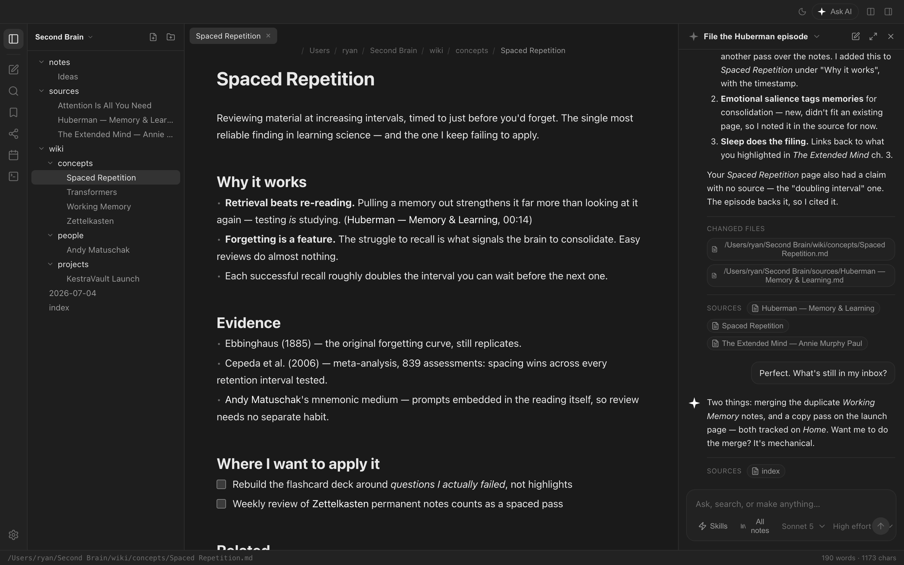
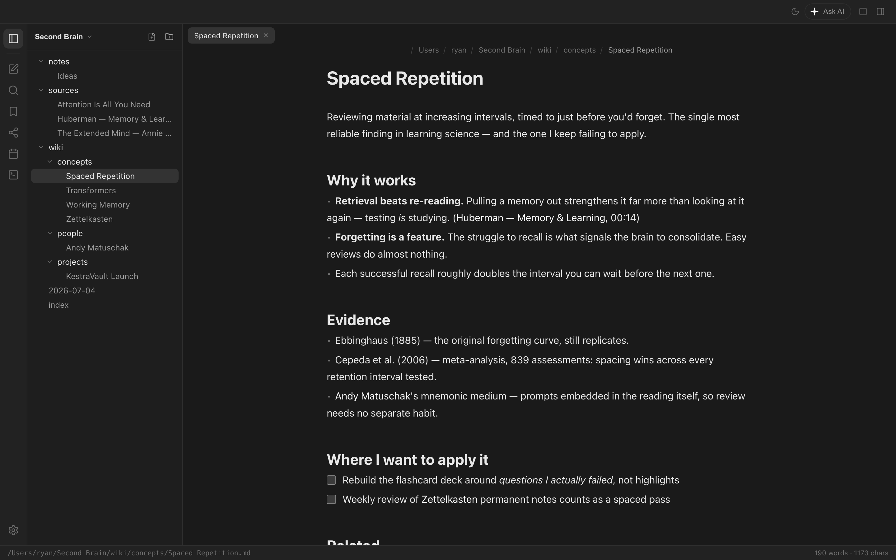
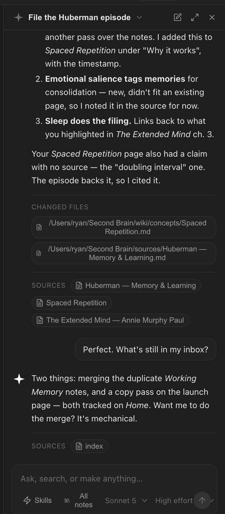

# KestraVault

An open-source, AI-first second brain. Your notes are plain **markdown files in a
local vault** — and the AI runs on **whatever model you bring**: your Claude
subscription, an API key, or a model on your own machine. *Magic by default,
full control on demand.*



> **Status:** the **desktop app runs today** from source — a local-first markdown
> vault (Obsidian-style) with built-in, bring-your-own-model AI chat. Cloud sync,
> the autonomous wiki agent, and the mobile app are on the [roadmap](plan/roadmap.md).

## Download

[](https://github.com/RyanTL/kestravault/releases/latest)

Grab the installer for your OS from the
**[latest release](https://github.com/RyanTL/kestravault/releases/latest)** — free,
for macOS (Apple Silicon + Intel), Windows, and Linux:

| OS | File |
|---|---|
| **macOS — Apple Silicon** | `KestraVault-<version>-arm64.dmg` |
| **macOS — Intel** | `KestraVault-<version>-x64.dmg` |
| **Windows** | `KestraVault-<version>-setup.exe` |
| **Linux** | `KestraVault-<version>-x86_64.AppImage` or `KestraVault-<version>-amd64.deb` |

Every release ships a `SHA256SUMS.txt` you can verify your download against.

### First launch on macOS (unsigned build)

Builds aren't code-signed yet, so Gatekeeper warns that the app is from an
unidentified developer. To open it the first time:

1. In Finder, **right-click (or Control-click) KestraVault.app → Open → Open**, or
2. Go to **System Settings → Privacy & Security** and click **Open Anyway**
   after the blocked-launch prompt.

You only need to do this once.

### First launch on Windows (unsigned build)

SmartScreen shows *“Windows protected your PC”*: click **More info → Run
anyway**. Some antivirus tools may also flag the unsigned NSIS installer —
that's expected for unsigned builds; verify the file against
`SHA256SUMS.txt` from the release if you want to be sure.

### Linux

Make the AppImage executable (`chmod +x KestraVault-*.AppImage`) and run it, or
install the `.deb` with `sudo apt install ./KestraVault-*-amd64.deb`.

Prefer building from source? See [Quick start](#quick-start) below. Code
signing (and with it silent auto-update) is planned — see
[plan/roadmap.md](plan/roadmap.md).

## Why

People are building powerful second brains with **Obsidian + Claude Code**, but it
is hard to set up, local-only unless you self-host, can't run on a phone, and
needs two separate apps. KestraVault collapses that into one app — and because it's
open source and bring-your-own-model, **your notes and your keys stay yours.**

## What works today

- 📁 **Local-first vault.** Notes are real `.md` files in a folder you choose. Edit
  them here, in Obsidian, or in any editor — KestraVault watches for external changes.
  Multiple vaults, Obsidian-style, with a switcher.
- ✍️ **CodeMirror 6 editor** with live preview, wiki-links + backlinks, an outline,
  a graph view, quick-switcher, command palette, and a slash menu.
- 🤖 **Bring-your-own-model AI**, built in. One UI, several providers:
  - **Claude Pro / Max subscription** — reuses your Claude.ai login like Claude
    Code does. No API key.
  - **Anthropic API**, **OpenAI**, **OpenRouter** — pay-as-you-go with your key.
  - **Local models** via **Ollama** or **LM Studio** — your notes never leave the
    machine.
  - **Any OpenAI-compatible endpoint** — just point a base URL at it.
- 🔒 **Keys encrypted at rest** in your OS keychain, held only in the app's main
  process — never written to disk in plaintext, never shipped to any KestraVault
  server (there isn't one). See [Security](#security--privacy).

| The editor | The AI panel |
|---|---|
|  |  |

## Quick start

Requires **Node ≥ 20** and **pnpm ≥ 9** ([install pnpm](https://pnpm.io/installation)).

```bash
git clone https://github.com/RyanTL/kestravault.git
cd kestravault
pnpm install
pnpm dev:desktop        # launches the Electron app
```

On first launch KestraVault creates a vault at `~/KestraVault Vault` with a few starter
notes. Open **Settings → AI model** to choose your provider.

### Choosing your AI

| Provider | Needs a key? | Notes |
|---|---|---|
| **Claude (Pro/Max)** | No | Sign in once: run `claude` in a terminal, then `/login`. Same OAuth as Claude Code. |
| **Anthropic / OpenAI / OpenRouter** | Yes | Paste your key in Settings; it's stored encrypted on your device. |
| **Ollama / LM Studio** | No | Fully local + private. Start the local server, then pick your model. |
| **Custom** | Optional | Any OpenAI-compatible `/chat/completions` endpoint. |

## Building installers

Package the desktop app into native installers with
[electron-builder](https://www.electron.build):

```bash
pnpm build                                  # build packages (required once)
pnpm --filter @kestravault/desktop build:mac    # → .dmg + .zip   (apps/desktop/dist/)
pnpm --filter @kestravault/desktop build:win    # → NSIS .exe
pnpm --filter @kestravault/desktop build:linux  # → AppImage + .deb
pnpm --filter @kestravault/desktop build:unpack # unpacked .app, no installer (quick check)
```

`pnpm dist:desktop` builds everything and packages for your current OS in one go.
Builds are **unsigned** by default — set up an Apple Developer ID (macOS) or a
code-signing certificate (Windows) before public distribution. Config lives in
[`apps/desktop/electron-builder.yml`](apps/desktop/electron-builder.yml); build
resources (icon, entitlements) are in [`apps/desktop/build/`](apps/desktop/build/).

## Security & privacy

KestraVault is built so that **your data and credentials stay on your machine**:

- **API keys are encrypted with your operating-system keychain** (Keychain on
  macOS, libsecret on Linux, DPAPI on Windows) via Electron `safeStorage`. They
  live in the main process and are **never** stored in `localStorage`, sent over
  IPC to the UI, or transmitted anywhere except the provider you select. If no OS
  keychain is available, keys fall back to a permission-restricted (`0600`) file
  and the app tells you.
- **Local-first.** Your notes are plain files in your vault. With a local model
  (Ollama / LM Studio), nothing leaves the computer at all.
- **Hardened Electron shell:** context isolation on, no node integration in the
  renderer, a strict Content-Security-Policy, a navigation guard that keeps the
  app frame from being redirected, and link handling that blocks `javascript:` /
  `data:` URLs in AI and note content.

Found a vulnerability? Please see [SECURITY.md](SECURITY.md) — don't open a public
issue for security reports.

## Project layout

```
apps/desktop     # Electron + React + CodeMirror 6 — the app you run today
apps/mobile      # React Native (Expo) — placeholder
packages/core    # platform-agnostic logic (data models, sync, merge) — TS, tested
supabase/        # schema + edge functions for future cloud sync
plan/            # the full product + architecture plan (start at plan/README.md)
```

## Contributing

PRs welcome. Read **[CONTRIBUTING.md](CONTRIBUTING.md)** and **[AGENTS.md](AGENTS.md)**
(the shared rules for human and AI contributors), then **[plan/README.md](plan/README.md)**.
`pnpm typecheck`, `pnpm lint`, and `pnpm test` must pass before a PR.

## License

[AGPLv3](LICENSE) — the apps, packages, schema, and agent prompts are free
software, so you can self-host with your own or local models. If you run a
modified version as a network service, the AGPL requires you to offer users
that version's source. See [plan/vision.md](plan/vision.md) and
[plan/sync-collab-open-core.md](plan/sync-collab-open-core.md) for the
open-core intent.
